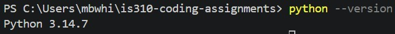
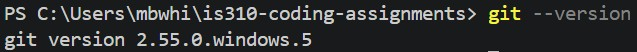
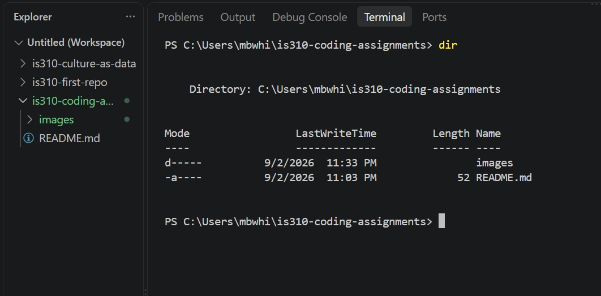

# Init IS310 Homework

## Proof of Installation

1. Python

2. Git

3. VS Code

4. Hypothesis Username: Auroraj3

5. AI Tool/Workflow
I do not intend to use any AI whatsoever. By "AI" I am referring to generative AI and/or chatbots. If we have any long-form writing assignments that I would use a Google Doc or a Word document for, I will possibly have spellcheck/grammar-check turned on. However, it won't be automatic, and it will just be the generic Word and/or Google Doc spellcheck/grammar-check that has existed since before AI in the colloquial sense existed in the public consciousness (so as far as I know, I don't think it counts, but better safe than sorry). Also, I just found out (as of 9/3 during class) that the Zoom chat (or maybe it's just my computer??) has an autocorrect feature that I don't know how to turn off, so that will also be minutely editing my comments in the Zoom chat without me necessarily noticing, I guess.
