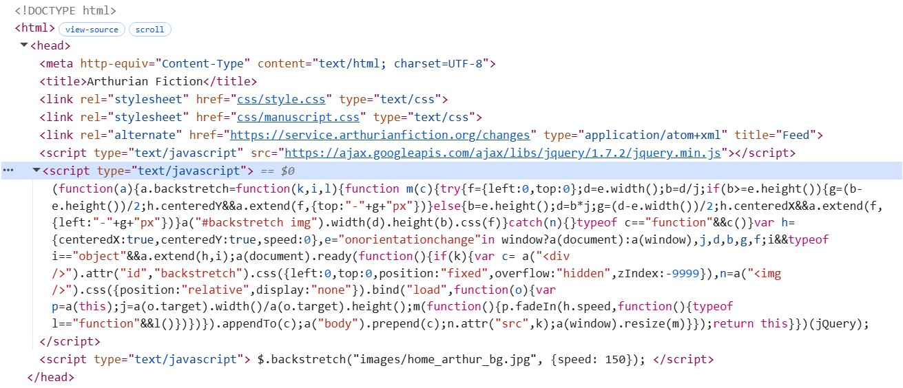
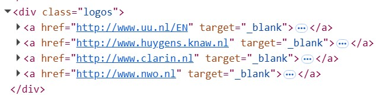
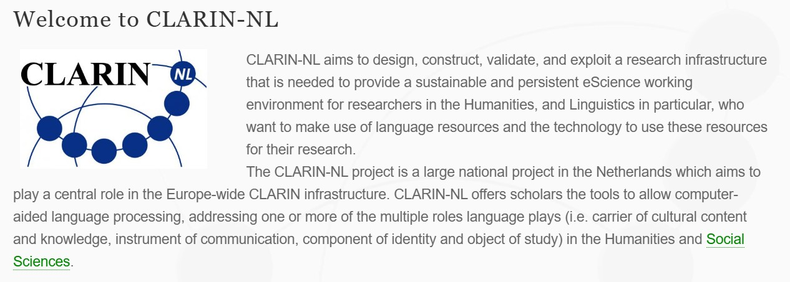
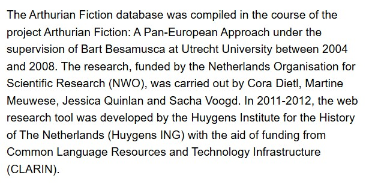
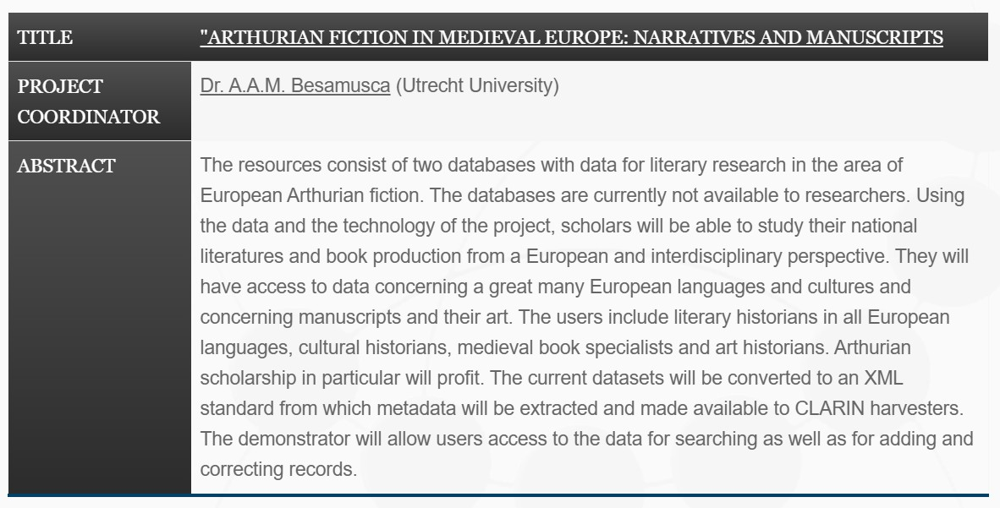

# Source and Style
## Assignment 1: Inspecting the Cultural Web

HTML is the DOCTYPE of the database. CSS is definitely used as there seem to be .css files in the head section (see Figure 1). I say "seem to be" as it's a little hard to tell the difference between a link and a file since they are both underlined, hoverable, and utilize periods and slashs frequently, not to mention the fact that the two instances of ".css" I saw were both following the href attribute, which I know is used for links. There is also definitely some JavaScript used located just below the CSS stuff (see Figure 1), including what seems to be a .js file. Although, it's once again hard to tell whether it's a link or a file. There are many other file types I recognize (gif, jpg, and pdf), but there is also a section where .nl shows up repeatedly, which I presume to be a file type I'm unfamiliar with (see Figure 2).

Upon further research, I have found the CLARIN-NL website (see Figure 3), which is sort of a parent organization to the Arthurian Fiction database. Given that the organization originates in the Netherlands, I presume that nl (from .nl and CLARIN-NL) stands for NetherLands. The Arthurian Fiction database was compiled as part of a research project conducted by Cora Dietl, Martine Meuwese, Jessica Quinlan, and Sacha Voogd under the supervision of Bart Besamusca at Utrecht University (see Figure 4). Dr. Bart Besamusca (aka A. A. M. Besamusca) is also listed as the project's coordinator on the CLARIN-NL website (see Figure 5).

Unfortunately, I couldn't really find more information about who all was involved/in what way (that is, as of yet). I also couldn't find details on who specifically was involved in creating the website for the project (beyond the fact that the web tool was developed by Huygens ING (see Figure 4)), nor could I locate a GitHub page related to the project. I will be continuing to investigate this as the semester progresses though!

Figure 1: head section of https://www.arthurianfiction.org/ inspect panel

Figure 2: logos div of body section of https://www.arthurianfiction.org/ inspect panel

Figure 3: welcome section of CLARIN-NL website (https://www.clarin.nl/node/2.html)

Figure 4: Arthurian Fiction project description on website home page (https://www.arthurianfiction.org/)

Figure 5: information about the Arthurian Fiction project via https://www.clarin.nl/node/162.html#ArthurianFiction
